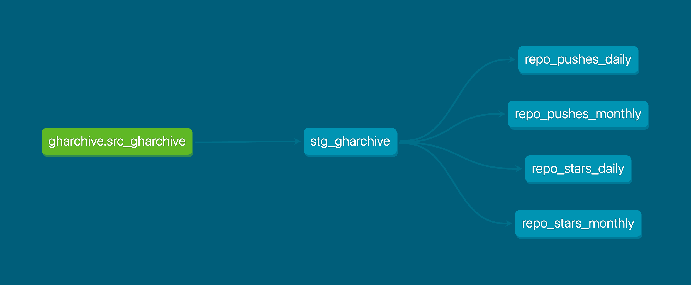

# GitHub Gems: Driving Open-Source Investments With Data

Welcome to GitHub Gems, a repository designed to track and analyze the popularity and development activity of open-source repositories on GitHub. The goal is to provide insights into key metrics that help users make informed decisions based on repository activity.

## Project Overview

GitHub Gems provides a streamlined data pipeline for analyzing trends, reduces manual effort, and enables deeper insights into the open-source ecosystem in GitHub repositories. Using tools like DuckDB and dbt(data build tool) and best practices such as dimensional modeling, we aim to create a scalable and reliable solution for data-driven decision-making. The repository enables users to track the growth of repositories by analyzing their stars, commits, forks, and issues. This makes it easier to identify fast-growing repositories and track long-term trends in repository activity.

## Key Metrics
**Stars:** Track the growth and popularity of repositories over time.
**Commits:** Monitor development activity with the frequency of commits.
**Forks:** Measure how many times the repository has been forked, indicating user engagement.
**Issues:** Analyze the number of open and closed issues for ongoing project discussions and maintenance.

# Data Sources: GHArchive & GitHub API

**GHArchive** provides historical GitHub data since 2011, making it ideal for bulk data analysis and long-term trends. It’s easy to query using SQL-like syntax with tools like Google BigQuery and offers free, comprehensive coverage of GitHub activities. However, its data updates daily (not real-time) and requires processing large datasets, which may be excessive for small, specific queries.

**GitHub API** allows real-time data fetching, is well-documented with REST and GraphQL interfaces, and enables fine-grained queries for focused data retrieval. On the downside, it has rate limits that can be restrictive for large requests, isn’t suited for historical data, and requires more complex integration for large-scale analysis.

**Conclusion:** While both data sources are valuable, GHArchive is more suitable for the long-term analysis required in this repository due to its extensive historical data and scalability with SQL queries. Therefore, we will use GHArchive as the primary data source for tracking repository popularity and activity trends.

## Data Format
The data is delivered in SQL database using DuckDB for storage and querying, ensuring efficient data retrieval for analysis. Additionally, data can be exported in CSV format for easier manipulation, and reports or dashboards are available for visualizing repository growth and trends.

## Update Frequency
The data is refreshed daily to provide up-to-date insights into repository activity and trends, allowing users to track changes in real-time.

## Project Lineage Diagram

This project’s lineage is illustrated below:

